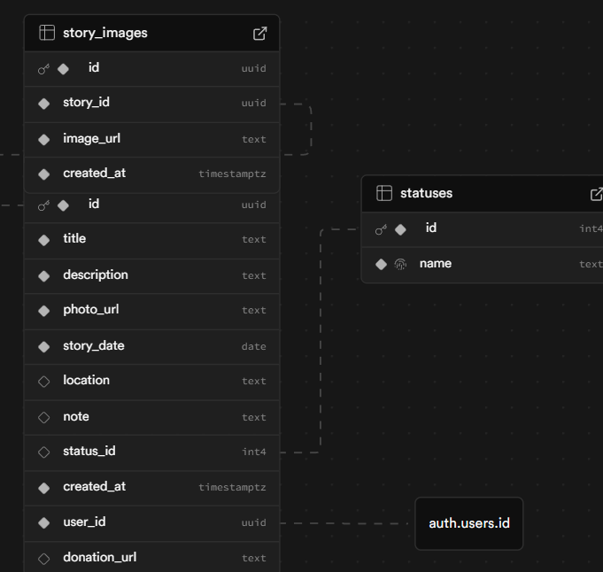

# Stray Tales 🐾

🚧 **Active development**

Stray Tales is a full-stack animal storytelling and case-management application built with **Next.js 16 App Router, React 19, TypeScript, and Supabase**. It stores animal stories, adoption and treatment statuses, event dates, locations, cover photos, additional images, notes, and optional donation URLs in PostgreSQL and Supabase Storage.

The application combines Server Components for the landing page and story listing, Client Components for authentication and interactive photo galleries, and Server Actions for story creation and updates. Supabase Auth provides email/password sign-in and cookie-based sessions through `@supabase/ssr`; PostgreSQL row-level security (RLS) restricts story access and mutations to the authenticated creator.

🌐 **Website**: [Animal Voices](https://www.animalvoices.gr/)

## Features

- Story listing ordered by creation date and individual story pages with photo lightboxes.
- Authenticated creation and editing of stories, with owner-specific edit and delete controls.
- Seven animal statuses covering adoption, foster care, treatment, missing animals, and other outcomes.
- Cover-photo uploads and additional gallery images stored in the `stories-photos` bucket.
- Optional donation URLs stored with each story; no payment-processing integration is implemented.

## Tech Stack

| Layer | Implementation |
| --- | --- |
| Framework | Next.js 16 App Router, React 19, React Compiler enabled |
| Language | TypeScript 5 |
| Styling | Tailwind CSS 4 and component-level inline styles |
| Database | Supabase PostgreSQL with SQL migrations and story ownership policies |
| Authentication | Supabase Auth, email/password login, `@supabase/ssr` cookie handling |
| Media | Supabase Storage; `next/image` on story detail pages |
| Production build | Next.js standalone output; multi-stage Node.js 22 Alpine Dockerfile |
| Code checks | ESLint 9 with Next.js configuration |

## Architecture

The browser and Next.js server use separate Supabase clients in `src/lib/supabase/`. Server Components query stories using the request's session cookies. Client Components handle sign-in, image uploads, story-detail fetching, and deletion through the browser client.

The story creation form uploads images directly to Supabase Storage, then submits their public URLs and story metadata to a Server Action. The action verifies the user, inserts a `stories` row linked to `auth.users`, inserts additional `story_images` rows, and redirects to the detail page. Editing uses a Server Action defined in the edit page. These database writes are separate operations rather than a single transaction.

The root `proxy.ts` delegates session validation and cookie refresh to `src/lib/supabase/proxy.ts`. Its current matcher covers the landing page, story routes, and admin routes, redirecting unauthenticated requests to `/login` except for `/login` and `/auth` paths. The admin layout adds a session check. Access is based on authentication and record ownership; a separate administrator role is not implemented.

## Local Development

Use Node.js 22, npm, and a Supabase project with Auth, PostgreSQL, and Storage enabled.

1. Install dependencies:

   ```bash
   npm ci
   ```

2. Create `.env.local` at the repository root:

   ```dotenv
   NEXT_PUBLIC_SUPABASE_URL=https://your-project.supabase.co
   NEXT_PUBLIC_SUPABASE_PUBLISHABLE_KEY=your-publishable-key
   ```

   The browser and server clients both read these exact variable names. The additional POST route at `/admin/stories/new/api` reads `SUPABASE_SERVICE_ROLE_KEY`, a server-only credential. The story creation form uses the Server Action instead; that POST route currently inserts fields that differ from the migration schema.

3. Apply the SQL files in `supabase/migrations/` in numeric order to a fresh Supabase project. Migration 4 deletes an existing `stories-photos` bucket and its objects before recreating it, so review it before applying it to a populated project.

4. Create an email/password user in Supabase Auth. The application provides a login form but no registration page.

5. Update the Supabase image hostname in `next.config.ts` to match your project, then start the development server:

   ```bash
   npm run dev
   ```

   Open [localhost:3000](http://localhost:3000) and sign in.

Available commands:

| Command | Purpose |
| --- | --- |
| `npm run dev` | Start the development server |
| `npm run lint` | Run ESLint |
| `npm run build` | Create the production build |
| `npm start` | Serve the production build |

## Docker

The included Dockerfile installs dependencies, builds Next.js, and runs the standalone server as user `1001`. There is no Docker Compose configuration in this repository.

The `NEXT_PUBLIC_SUPABASE_*` variables must be available **during the image build**, because Next.js embeds public configuration in the browser bundle. The current Dockerfile has no build arguments for these variables, and `.dockerignore` excludes `.env.local`; configure build-time environment injection before building the image. Passing an env file only to `docker run` does not configure the browser bundle.

Once an image has been built with the required configuration:

```bash
docker run --rm -p 3000:3000 --env-file .env.local stray-tales
```

## Project Structure

```text
src/
├── app/
│   ├── actions/                 # Story creation and logout Server Actions
│   ├── admin/
│   │   ├── layout.tsx           # Admin-area session check
│   │   └── stories/
│   │       ├── new/             # Creation form and additional POST route
│   │       └── edit/[id]/       # Editing action and gallery upload component
│   ├── login/                   # Email/password sign-in
│   ├── stories/
│   │   ├── page.tsx             # Server-rendered story listing
│   │   └── [id]/                # Client-rendered detail page and lightbox
│   ├── layout.tsx               # Shared layout; forces dynamic rendering
│   ├── page.tsx                 # Landing page and latest-story preview
│   └── globals.css              # Global styles and Tailwind import
└── lib/supabase/
    ├── client.ts                # Browser client
    ├── server.ts                # Cookie-aware server client
    └── proxy.ts                 # Session validation and cookie refresh
supabase/migrations/             # Database tables, policies, and storage setup
proxy.ts                         # Next.js request proxy entry point
next.config.ts                   # Compiler, standalone output, image hostname
Dockerfile                       # Multi-stage production image
```

## Database and Storage

The application queries the tables defined in `supabase/migrations/`:

| Table | Purpose and relationships |
| --- | --- |
| `statuses` | Seven seeded status values, referenced by `stories.status_id` |
| `stories` | UUID-keyed records containing story metadata, a cover-photo URL, and an owner referencing `auth.users` |
| `story_images` | Additional image URLs referencing `stories`; rows cascade on story deletion |

The checked-in story RLS policy allows users to select, insert, update, and delete only their own stories. Anonymous story browsing requires changes to both the request proxy and database read policies. The migrations do not enable RLS or define access policies for `story_images`.

The public `stories-photos` bucket accepts JPEG, PNG, and WebP files up to 5,000,000 bytes. Storage policies allow public reads and authenticated uploads and deletes within the bucket; deletes are not restricted by uploader ownership. Deleting a story cascades its gallery database rows but does not remove image files from Storage.

`schema.sql` contains a separate `Animal` / `BlogPost` / `AdminUser` model that is not queried by the application. Use the migrations as the reference for the implemented data model. The existing diagram is retained below for context; verify it against the migrations when updating database documentation.



## Current Implementation Notes

- Donation URLs can be created and edited but are not rendered as links on the story detail page.
- The detail page renders the `note` field, although the forms label it as an internal note.
- `ExistingImagesClient.tsx` implements image removal but is not wired into the edit page.
- The CI workflow supplies `NEXT_PUBLIC_SUPABASE_ANON_KEY`, while the application reads `NEXT_PUBLIC_SUPABASE_PUBLISHABLE_KEY`; align this configuration for CI builds.

## License

[MIT](LICENSE.txt)
